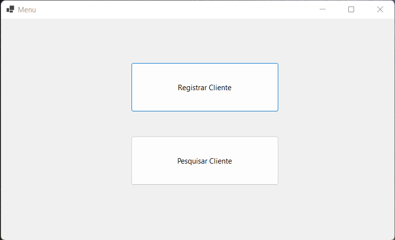
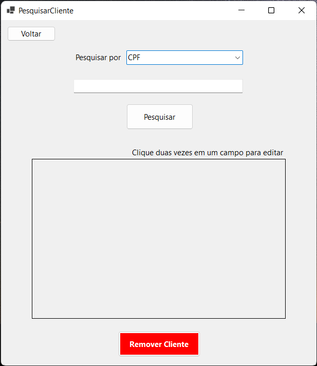
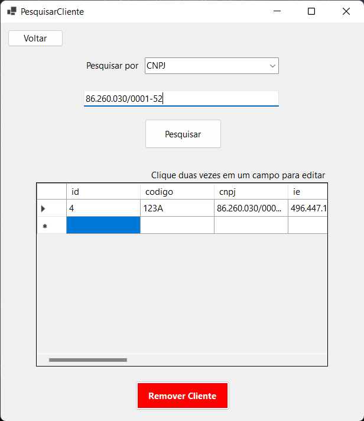
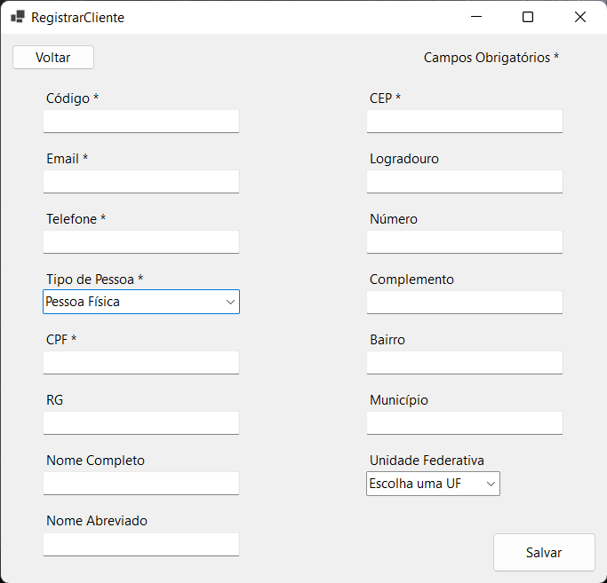

## Windows Forms Demo

A simple application created to study and practice a bit about the Microsoft Tech Stack, including C#, Dotnet 6, SQL Server and Windows Forms. It is basically a CRUD app that registers, lists with several filter methods, edits and removes customers.

## Project Status

Even tough the project attend all it's requirements and it's essentially complete, there is always room for improvement and polishing.

## Project Screen Shot(s)   

## Installation and Setup Instructions 

Clone down this repository. You will need `Dotnet Core 6` and `SQL Server` installed on your machine. I strongly recommend using `Visual Studio` to run the project.

Installation:

Create a database called `WinFormsDemo` in SQL Server. I recommend using a tool like SQL Server Management Studio for that. Then, open the database SQL file contained in `Database/create-database`. After that, you should have a database with some empty tables in it.

After doing that, open the `.sln` file in Visual Studio and run the project.